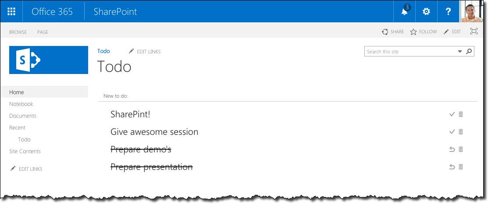

# Demo SharePoint Todo Web Part

This repository contains a sample SharePoint Todo Web Part built using Angular.

This Web Part is built using JavaScript and Angular. It is styled using the [Office UI Fabric](http://dev.office.com/fabric) and to simplify the implementation in Angular it uses [ngOfficeUIFabric](http://ngofficeuifabric.com/).

## Prerequisites

- SharePoint site with a Tasks list
- development environment with **node.js** and **npm** installed

## Getting started

- clone this repository
- in the command line run `npm i` to install required packages
- in the `./app/app.config` file change the values of the `sharepointApi` and `todoListName` properties to point respectively to the server-relative URL of the SharePoint API and the name of the Tasks list used to store todo items. The default configuration assumes that the List is located is a subweb called `Todo` and that the Tasks List is called `Todo`
- in SharePoint, add a Script Editor Web Part to a page and paste the contents of the `sewp.html` file as its snippet

## Running

- in the command line run `gulp serve`
- in the browser, navigate to the SharePoint page where you placed the Script Editor Web Part